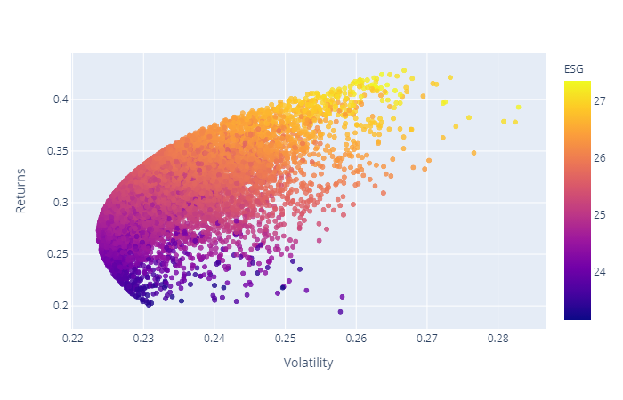
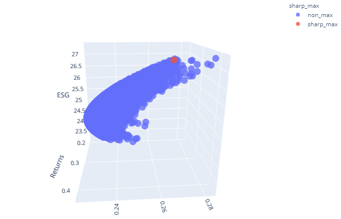
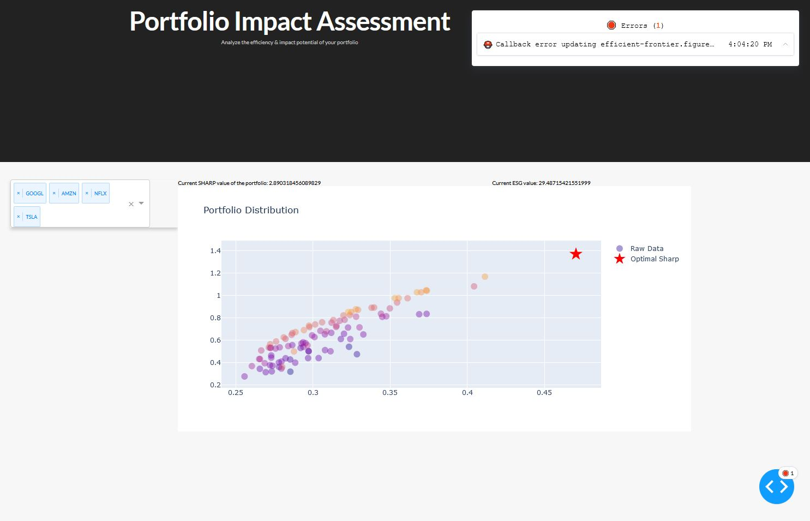

# portfolio-impact-assessment
## Interactively assess the sustainability of a stock portfolio

created by Johanna Einsieder & Fabian Dietrich at the AustrianStartups Hackathon 2021

Our project tries to solve the problem of how to do good (or at least not bad) when investing while at the same time achieving high profits. Why does it always have to be a trade-off — can't we get both? For this, we pull price data of companies from Yahoo Finance to compute their risk-return ratios and their ESG scores. We plot these data in a 3-dimensional matrix to find the efficiency frontier of volatility, returns, and sustainability. 

Good companies are all on this frontier. Depending on our individual preferences for different amounts of sustainability, profit, or risk, we can make rational decisions on how our portfolio should be composed. The following pictures show the efficiency frontier with example portfolios:

2D-Plot with color-coded ESG score (high values on the x and y axis indicate a high (good) sharp ratio, high (yellow) values on the ESG color axis indicate a bad sustainability score)

3D-Plot with sharp-ratio maximum in red

### Interactive Dashboard
We created an interactive dashboard, which allows users to specify their current portfolio mix. Based on their individual portfolio, our algorithm suggests a single trade, which swaps one of the companies for another. By this, we want to give a user the opportunity to incrementally improve their portfolio, and pick the low-hanging fruit first.

Portfolio Impact Assessment Dashboard comparing GOOGL, AMZN, NFLX and TSLA

The optimization seeks to maximize sustainability across a user-defined portfolio, while keeping the Sharpe-Ratio (a risk-return indicator) at the same level or higher than before. In the example above, we compare the four trend stocks Google, Amazon, Netflix & Tesla.
